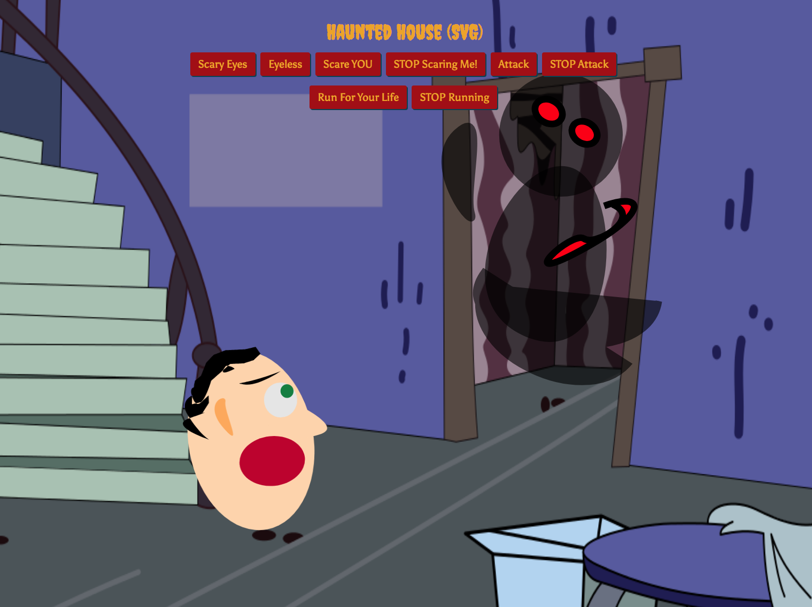
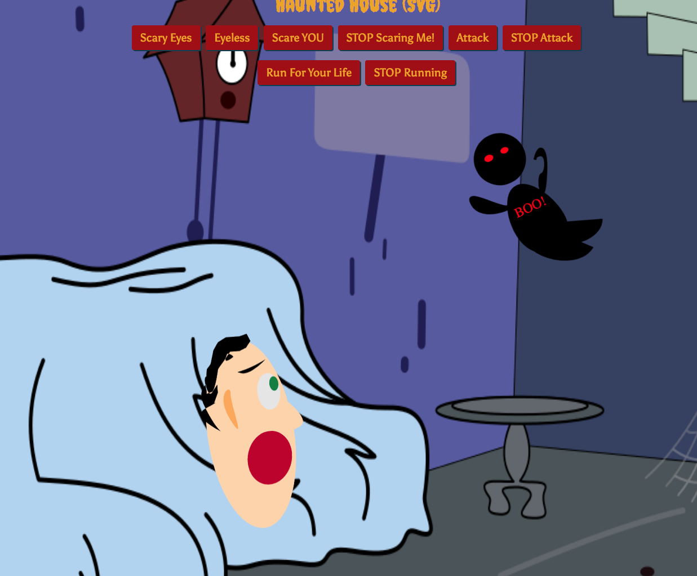
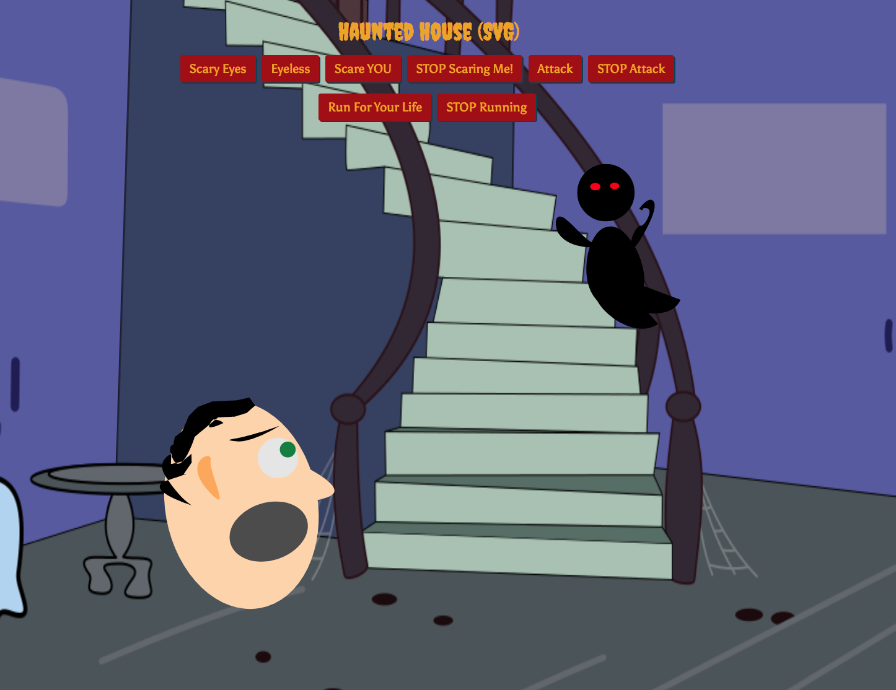

# [SVG-App: Haunted House](https://svg-app.herokuapp.com/)
##### Please click link/app-name above to see Heroku deployment.  
 

  

  
  

### Technologies Used:
##### SVG-edit - To Draw as Opposed to using Adobe Illustrator
##### Ruby on Rails was only used in order to deploy to Heroku.
##### Heroku

#### This simple SVG-based app was created to have some free fun outside of using Adobe Illustrator, utilizing instead SVG-edit to draw the ghost and person, and then animating it using CSS and Javascript.  Written using Javascript, CSS and HTML.

##### [Amit](https://amitzaman.com/)
